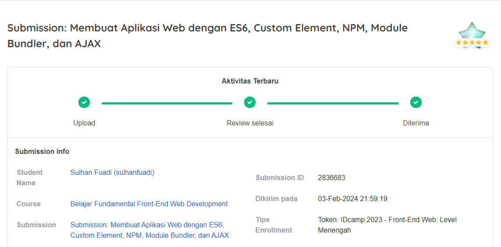
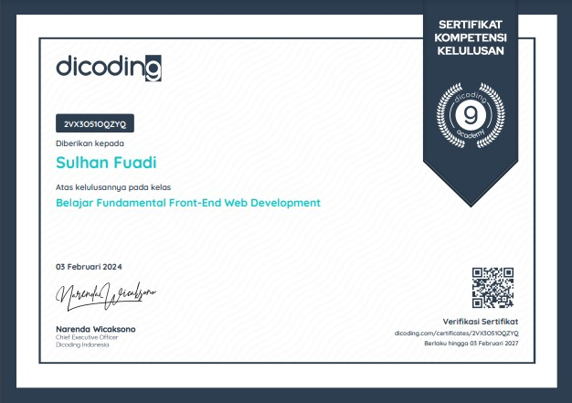

# CineBlue

**CineBlue** -  A website which was focused on a film search website. Created to fulfill a graduation [Belajar Fundamental Front-End Web Developer](https://www.dicoding.com/academies/163) class requirement at Dicoding Academy

---

 

## Website Preview :

 

 

## Features :

* **Showing movie list**,

* **Search for films**,
Write down the title of the film you are looking for and find the film you want!

* **Search for films according to genre**,
Take advantage of our features and get films according to the genre you want.

* **Display Responsibility**,
The appearance of the web app is responsive to various screen sizes.

 

---

 

## Getting Started

*To get started, install npm and then run the commands below to start it; a dist folder will be created after that.*

1. Clone this repository
   
   `git clone https://github.com/sulhanfuadi/CineBlue-main.git`

    `cd CineBlue-main`
   
2. Install NPM
   
   `npm install`

3. Build untuk distribusi production

   `npm run build`
   
4. Starting development server

   `npm run start-dev`

 

---

 

## Submission Criteria

The following are the criteria for project submission that you must fulfil:

- [x] Uses standard *ES6 syntax* in writing *JavaScript* code in the created project. **(Done)**

- [x] There is at least one *custom element* implementation. **(Done)**

- [x] Using *Webpack* as module bundler (production stage). **(Done)**

- [x] Utilizing *Webpack* as an *environment* in project development (*development* stage). **(Done)**

- [x] Utilizing APIs by using the *AJAX* concept in displaying dynamic data in the applications created. **(Done)**

- [x] You are free to determine the theme of the application you want to create**,** *with the exception* of the themes *Club Finder/**Sports Club Search*, *Football*, or *Dicoding Books*. **(Done)**

  

## Rating & Suggestions

Your submission will be assessed by reviewers with **star ratings on a scale of 1-5** based on existing parameters. You can apply some **suggestions** to get high scores; here are the suggestions:

- [x] Implement an attractive application appearance:
   - Have a colour selection that fits the application theme (in choosing colours, you can use colour selection tools such as [colorhunt. co](http://colorhunt.co/)). **(Done)**
   - Fitting element layout. **(Done)**
     Example: There is no nested content.
   - Use fonts that fit the theme. **(Done)**
   - Application of padding appropriate margins. **(Done)**
   - Responsive on all device screen sizes. **(Done)**
- [x] Using 3rd party packages installed via the package manager (not CDN), for example:
   - Lodash
   - Axios
   - JQuery 
   - etc. **(Done)**
- [x] Write code cleanly and consistently. You can use Linters, such as ESLint, to maintain the code writing style. **(Done)**
- [x] Explore webpack implementation. Like:
   - Using loaders or plugins other than those taught in the module. **(Done)**
   - Implement bundle optimizations such as minifying or splitting chunks. **(Done)**

The following are the details of the submission assessment:

- **1 Star**: All conditions are met, but there are indications of plagiarism, namely, using other people's projects and only changing the content.
- **2 stars**: All conditions are met, but not better than the training provided.
- **3 stars**: All conditions are met, but only follow the exercises in class.
- **4 stars**: All conditions are met, and at least 2 (two) of the suggestions above are implemented.
- **5 Stars**: All conditions are met, and at least 4 (four) suggestions above are implemented. **(Done)**

 

---

 

## Warning!

This repository is a submission from Dicoding for the [Belajar Fundamental Front-End Web Developer](https://www.dicoding.com/academies/163) class. This class has submissions that must be completed to receive a certificate. The contents of this repository are the final section that includes the required criteria.

Make this repo a reference/reference.
- By the terms of use at Dicoding, Dicoding Academy class submissions must be your work.
- Code obtained from other sources (websites, books, forums, GitHub, etc.) is only used as a reference. The level of similarity cannot be more than 70%.

Big thanks to [Dicoding](https://www.dicoding.com/)

 

---

 

## Certificate

 

---

 

### Author
<strong>[Sulhan Fuadi](https://github.com/sulhanfuadi)</strong>
